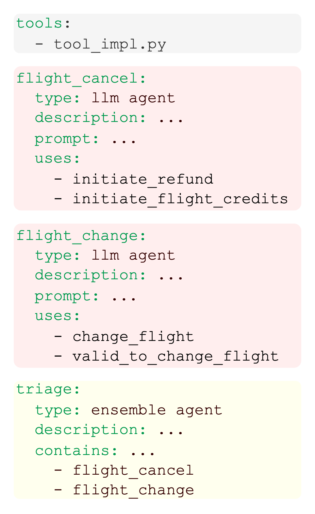
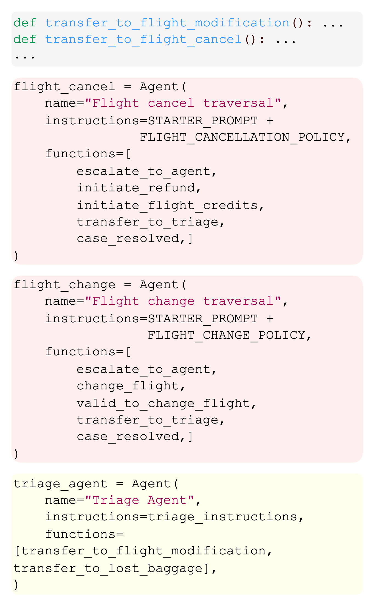
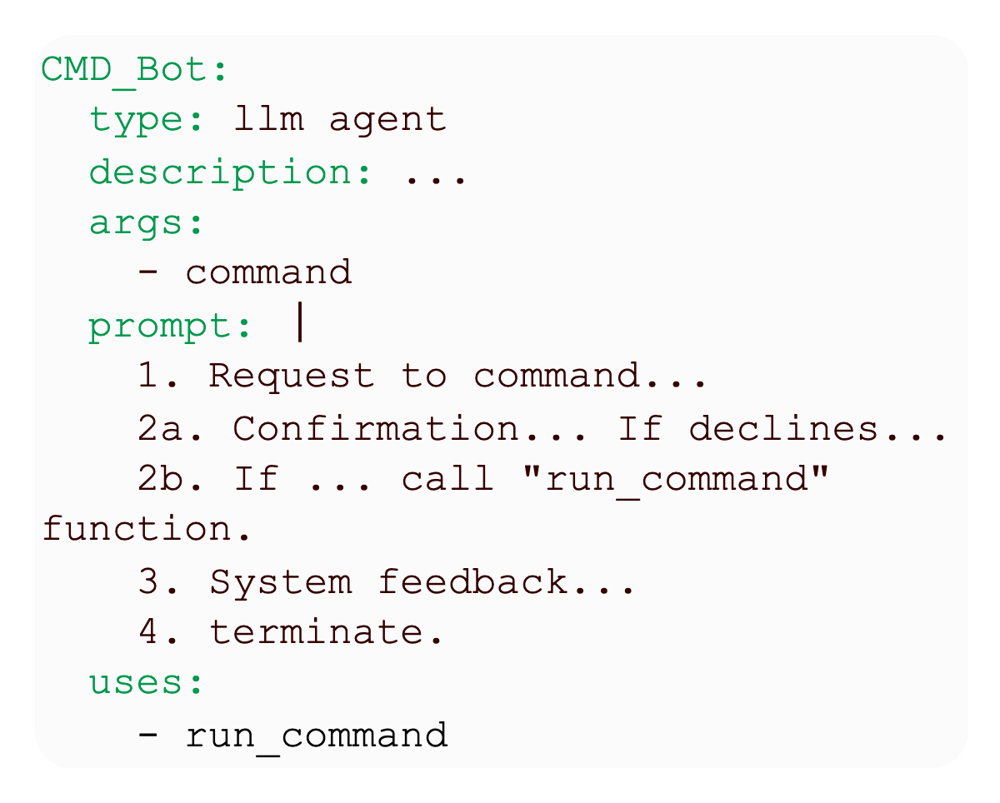
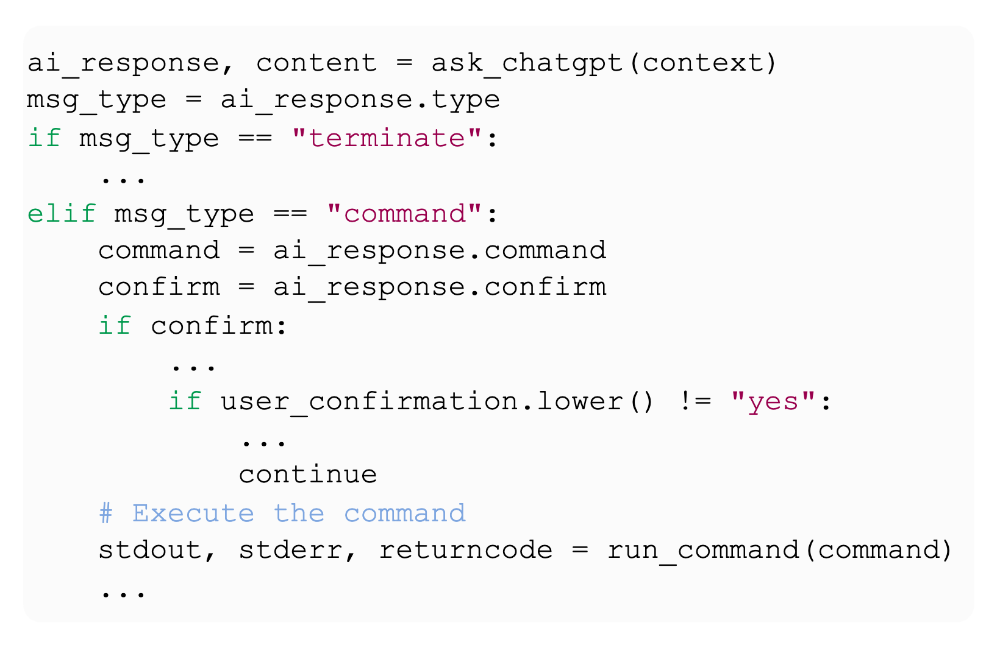
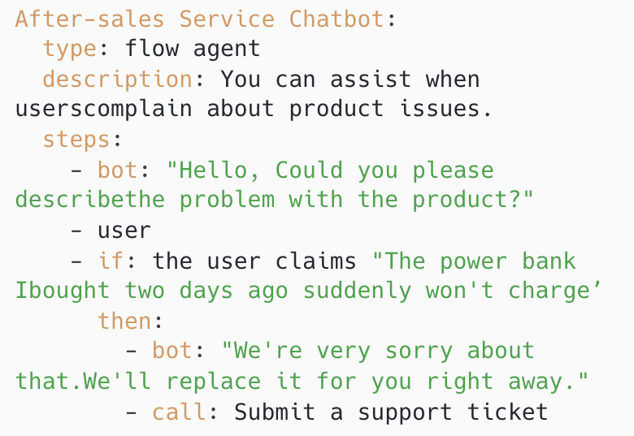

ADL (Agent Declarative Language) is designed for simplicity.  It is guided by three core principles. 

** Separate definition from execution (make it declarative) **

  

    
    
(a) ADL

  

  

    
    
(b) Swarm

  

** Program with natural language **

  

    
    
(a) ADL

  

  

    
    
(b) Python

  

** Simplify the syntax **

For the complete language specification, please refer to [ADL: A Declarative Language for Agent-Based Chatbots, Sirui Zeng, Xifeng Yan, 	arXiv:2504.14787](https://arxiv.org/pdf/2504.14787). 
