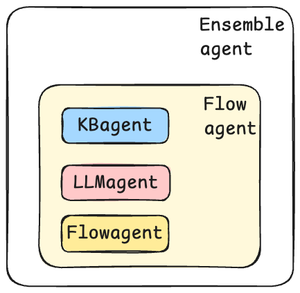

Agents are the building blocks of MICA. You can create different kinds of agents based on the tasks you would like to assign to them.  There are four types of agents in MICA: KB Agent, LLM Agent, Flow Agent, and Ensemble Agent. KB Agents handle information retrieval and question-answering tasks. LLM Agents encode business logic and workflows using natural language. Flow Agents enable traditional control flows through a domain-specific language. An Ensemble Agent orchestrates these agents and serve users collectively.  KB and LLM Agents are atomic meaning they cannot contain other agents.  Ensemble Agents are composite agents.  Flow Agents can be both.
<center>

<br>
<div>Types of Agents</div>
</center>

## KB Agent
A KB Agent is designed to handle KBQA (Knowledge Base Question Answering) tasks. If you have FAQ questions, documents, or websites, and want your chatbot to answer user questions based on them, you only need to declare a KB Agent. The agent will handle all the tehnical details for you, including vectorization, indexing, RAG, etc. Here is an example:

```yaml
kb:   # agent name
  type: KB agent
  faq:
    Are you a robot?: Yes, I'm your virtual assistant.
    Goodbye: Thank you, bye.
  web:
    - http://url
  file: /path/to/kb/files
```

The agent name can be any string that complies with YAML. This KB Agent contains four attributes:

- `faq`: You can define specific questions and their corresponding answers. Use each question as a key and its answer as the value.
- `web`: You can list all relevant websites here. Our engine will automatically crawl the content of these websites and use it as part of the knowledge base.
- `file`: This field includes files with `.doc`, `.pdf`, or `.csv` extensions. You can specify a directory and place files there. The engine will digest all the content in this directory and put it in the knowledge base.

Given a user utterance, the KB Agent will determine if it is a question and if it can be answered by the knowledge base it builds.

## LLM Agent
LLM Agents serve as the fundamental building block for task-oriented conversations. It specifies domain knowledge and constraints through prompt programming. Additionally, LLM Agents can use tools and states to communicate. 

```yaml
transfer_money:
  type: llm agent
  description: This is an agent for transfer money request.
  prompt: |
    You are a smart agent for handling transferring money request. When user ask for transferring money, 
    it is necessary to sequentially collect the recipient's information and the transfer amount. 
    Then, the function "validate_account_funds" should be called to check whether the account balance is sufficient to cover the transfer. 
    If the balance is insufficient, it should return to the step of requesting the transfer amount. 
    Finally, before proceeding with the transfer, confirm with the user whether the transfer should be made and then call "submit_transaction".
  args:
    - recipient
    - amount_of_money
  uses:
    - validate_account_funds
    - submit_transaction
```
The above is an example of using an LLM Agent to handle money transfer. A typical LLM Agent includes the following attributes:

- `description`: This field provides a brief explanation of the agent’s functionality. Based on the conversation context, LLM will use this field to determine whether this agent should be used for the response or not.
- `prompt`: This field details the process for the agent. If certain functions need to be called during the process, the prompt should indicate when and which function to call.
- `args` (optional): If you need to extract specific information (slots) from the conversation, you could fill out this field. Currently, all slots are strings.
- `uses` (optional): This lists all the function names used in the prompt. These functions can be implemented in a separate Python script.

When calling the LLM Agent, MICA will automatically fill in all the args based on the defined content and call the corresponding Python functions based on the LLM’s response. This process continues until the LLM Agent’s task is completed or the user changes his mind and needs a different agent to handle his request. 

## Flow Agent
The Flow Agent is suitable for fixed, sequential business logic.  It enables flow control commonly existing in traditional programming language using a YAML format.
```yaml
shopping_flow:
  type: flow agent
  description: This is an agent that assists users in placing orders.
  args:
    - discount
  steps:
    - begin
    - bot: Hi. I'm your shopping assistant. What can I do for you today?
    - label: start
    - user
    - if: the user claims "Is there any discount?"
      then:
        - call: discount
        - if: discount.success
          then:
            - bot: We are glad to tell you that your get 10% discount.
          else:
            - bot: Sorry. There's no discount for you.
    - else if: the user claims "I'd like to buy something"
      then:
        - call: order
        - call: shipment
        - call: submit_info
          args:
            - user_name: meta.user_name
            - items: order.items
            - discount: discount
            - address: shipment.address
            - contact: shipment.contact
      else:
        - bot: "You can ask me something like \"Any discount?\" or \"Start shopping.\"."
        - call: start
          tries: 3
    - end

    - begin: discount
    - if: meta.is_new_customer == True
      then:
        - set: 
            discount: 0.9
        - return: success, Load discount successful.
      else:
        - return: error, No discount applied.
    - end
  fallback:
    - policy: "Give a fallback message: I'm sorry, I didn't understand that. Can you please rephrase? If fallback three times consecutively, then terminate the conversation."
```
A Flow Agent typically has the following attributes:

- `description`: Similar to LLM Agent, the description of the Flow Agent should briefly explain its functionality.
- `args` (optional): The variables that need to be collected from the flow. 
- `steps`: This is the main attribute of the Flow Agent, where all the logic is written.  Please refer to Flow Control for more details. 
- `fallback` (optional): If the user’s input is unrelated to the current flow and this field is defined, the flow will follow the specified fallback policy. Otherwise, the flow will terminate immediately.

## Ensemble Agent
Ensemble Agents are different from the other three agents that have actual conversational functionality. Its main role is to manage and assign different agents to provide responses.  Here is an example,
```yaml
Meta:
  type: ensemble agent
  contains:
    - flow agent
    - llm agent
  args:
    - user_name
    - user_gender
  fallback: default_agent
  exit: 
    policy: "exit policy here"
```
You need to fill out the following information:

- `contains`: List all the agent names managed and scheduled by this Ensemble Agent.
- `args` (optional): Similar to before, the variables(slots) for this Ensemble Agent are defined here. If the arg names defined here match those in the agents listed, the values from those agents will be automatically filled into this field.
- `fallback` (optional): If the user’s input cannot be handled by any agent listed, and no fallback is defined, there will be no response. Otherwise, you can specify an agent, e.g., LLM Agent/Flow Agent, to handle the fallback response. You can also define a policy to describe the fallback condition.
- `exit` (optional): When the user has completed a specific process, if exit is not defined, the bot will continue running. If defined, the bot will terminate the conversation after 3 tries. You can customize your exit policy, similar to how you define a fallback.
