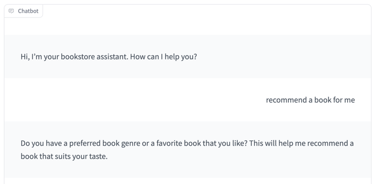
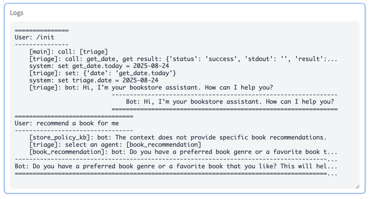
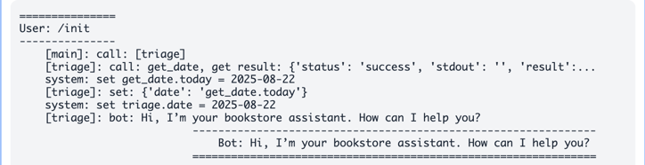
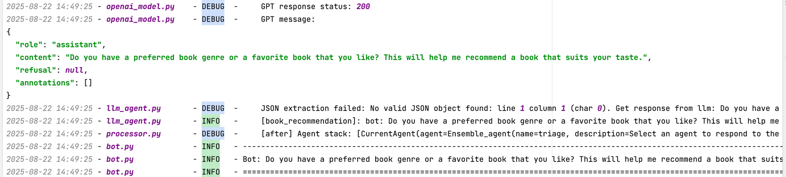

When developing a chatbot, various issues may arise. To support troubleshooting, MICA provides comprehensive logging capabilities for effective debugging.

## Using the Workbench
When programming with [MICA Workbench](/docs/start/index#mica-workbench), you can view agent logs directly. 
The figure below shows a log example from the [**bookstore example**](/docs/start/bookstore). The left side displays the actual conversation, while the right one shows the corresponding logs.

In this example, the user asks the bot to recommend a book. At this point:  
- The **store_policy_kb** agent generates a reply,  
- The **triage** component does not adopt it and instead assigns the task to the **book_recommendation** agent,  
- The **book_recommendation** agent then produces the next reply, which is adopted as the bot’s response.

<p align="center">
  
  
</p>

The log file provides a clear record of control transitions among the three agents. Furthermore, if an agent includes specific execution steps, the log identifies the step currently in progress. This enables you to verify that the chatbot is operating in alignment with your expectations.  


For complete details, you can refer to the terminal where the service is running. It displays all runtime information, including **LLM request details**, which can be analyzed to optimize your chatbot’s performance.

>The same information will also be stored in the `logs` directory under the project path, with the file name `<bot_name>.log`. 



All logs shown on the MICA WorkBench are at the **INFO** level, while the .log file provides detailed **DEBUG**-level information for further analysis. 

## Deploying Chatbot Service
When [deploying a chatbot](/docs/start/index#locally-deployment), you can control the log verbosity using different arguments.  

If you only need brief information, start the chatbot service with:  

```bash
python -m mica.server -v
```

If you need more detailed information, start it with:
```
python -m mica.server -vv
```

## Bug Categories

Bugs in ADL programs can generally be classified into three categories:

1. **Prompt or Agent Design Errors.**
Unexpected chatbot behavior caused by flaws in the prompt or agent design. In such cases, review the logs, analyze the agent’s behavior, and refine the chatbot’s logic accordingly.

2. **LLM Response Errors.**
Instances where the LLM produces responses that deviate from the intended design. These issues can often be mitigated by selecting a different model for the agent or applying prompt engineering techniques.

3. **MICA Bugs.**
If the logs indicate that the issue does not fall into the first two categories, it may be a bug in MICA itself. In this case, please open an issue in the [Mica repository](https://github.com/Mica-labs/MICA). Our team will review and address it promptly.
