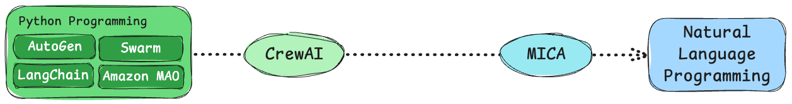
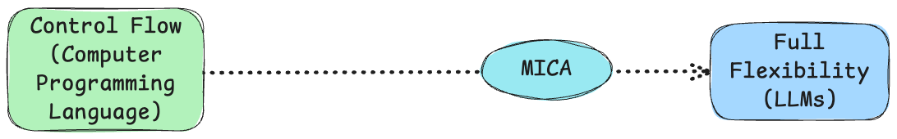
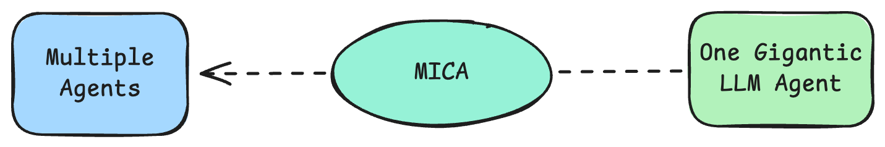

### Observation 1: Python Programming vs. Natural Language Programming
As the capabilities of large language models (LLMs) continue to grow, it is anticipated that natural language will increasingly dominate the design of agents. In this new paradigm, designers only need to provide high-level instructions and domain specific knowledge, leaving the language model to handle the intricacies of user interaction. 

<center>

</center>

<!--
<center>

<br>
<div> Obs. 1: Python Programming vs. Natural Language Programming</div>
</center>
-->
By their nature, the tasks performed by (human) agents are often expressed in natural language, while Python programs better serve as a bridge between agents and the computer world.  Whenever there is a tendency to use Python for control enforcement, it is often possible to achieve the same control logic solely through natural language. Here is an example of a natural language command line using LLM(ADL) vs. [Python+LLM](https://github.com/aaalgo/middleman).  The bot can translate a user’s natural language input into Bash commands, execute them, and return the results with a natural language explanation. ADL/MICA can achieve the same functionality using an LLM agent.
```yaml
tools:
  - executor.py

middleman:
  type: llm agent
  description: Ask GPT and get command/status/next action
  prompt: |
    You are the middleman AI, which sits between the user and the bash command line of a recent Ubuntu system. 
    Your input will be interleaved user input, the command you generate and system feedback from executing any of these commands.

    Your behavior:
    1. You should translate user's request into a command. 
    2a. If we need to explicit user confirmation before running the command, the user will be asked: "Run this command? (yes/no)";
    If the user declines, we will pass that feedback into your next input.
    2b. If we don't need to explicit user confirmation, call "run_command" function.
    3. Provide system feedback (stdout, stderr, or user-declined commands).
    4. terminate.

    Remember: The commands you generate should run without any user inputs.
  args:
    - command
  uses:
    - run_command
  
meta:
  type: ensemble agent
  description: You can select an agent to respond to the user's question.
  contains:
    - middleman
  
main:
  type: flow agent
  steps:
    - call: meta

```
The code responsible for program execution is the same as the Python+LLM's implementation.

```python
import subprocess
def run_command(command):
    """
    Executes a shell command, returning (stdout, stderr, returncode).
    """
    result = subprocess.run(command, shell=True, capture_output=True, text=True)
    return result.stdout, result.stderr, result.returncode
```

<details>
  <summary>Show the Python+LLM implementation of Middleman </summary>
  <pre><code>import openai
from typing import Literal, Optional
from pydantic import BaseModel
import subprocess
import json

SYSTEM_PROMPT = """
You are the middleman AI, which sits between the user and the bash command line of a recent Ubuntu system. 
Your input will be interleaved user input, the command you generate and system feedback from executing any of these commands.

Your behavior:
1. You always generate a response as a JSON object with the following schema:
    ...
2. The field 'type' can be:
   - "plain": A message that only displays 'content' to the user.
   - "command": A message containing a 'command' field to be executed on the system.
   - "terminate": A message indicating the conversation should end after displaying 'content' to the user.

3. If you provide a "command" of type "command":
   - The "content" field must always include an explanation or reason.
   - The "confirm" field specifies whether we need explicit user confirmation before running the command.
     - If "confirm" is true, the user will be asked: "Run this command? (yes/no)".
     - If the user declines, we will pass that feedback into your next input.
   - If "confirm" is false, we will run the command without asking for confirmation.

4. If "type" is "terminate":
   - We will display the "content" message to the user and then end the session.

5. You must always respond in valid JSON. 

Your role is to:
- Interpret user requests and any system feedback (stdout, stderr, or user-declined commands).
- Provide either an explanation, a new command, or end the conversation, based on the user’s needs.

Remember:
- Always respond in valid JSON.
- Do not include any additional text or markdown outside the JSON structure.
- The commands you generate should run without any user inputs.

class Response(BaseModel):
    type: Literal["plain", "command", "terminate"]
    content: str
    command: Optional[str]
    confirm: bool

client = openai.OpenAI()

# ANSI color codes
RED = "\033[31m"
GREEN = "\033[32m"
YELLOW = "\033[33m"
BLUE = "\033[34m"
RESET = "\033[0m"

def prompt_user():
    return input(">> ")

def format_message(user_input=None, command=None, stdout=None, stderr=None, declined=False):
    """
    Constructs a message with sections only if they have content:
      --- User Input:
      --- COMMAND:
      --- STDOUT:
      --- STDERR:
      --- DECLINED:
    """
    msg = ""
    if user_input:
        msg += f"--- User Input:\n{user_input}\n"
    if command:
        msg += f"--- COMMAND:\n{command}\n"
    if declined:
        msg += "--- DECLINED\n"
    if stdout:
        msg += f"--- STDOUT:\n{stdout}\n"
    if stderr:
        msg += f"--- STDERR:\n{stderr}\n"
    return msg

def ask_chatgpt(context):
    """
    Sends 'context' to OpenAI ChatCompletion and expects a JSON response:
      {
        "type": "plain" | "command" | "terminate",
        "content": "...",
        "command": "...",        # if type == "command"
        "confirm": bool,         # if type == "command"
        "terminate": bool        # optional if type == "terminate"
      }
    """
    response = client.beta.chat.completions.parse(
        model="gpt-4o",
        messages=context,
        response_format=Response
    )
    parsed = response.choices[0].message.parsed
    content = response.choices[0].message.content
    return parsed, content

def run_command(command):
    """
    Executes a shell command, returning (stdout, stderr, returncode).
    """
    result = subprocess.run(command, shell=True, capture_output=True, text=True)
    return result.stdout, result.stderr, result.returncode

def main():
    context = []
    carry_over_message = None  # Stores message for the next loop iteration

    # Optional system instruction:
    context.append({"role": "system", "content": SYSTEM_PROMPT})

    while True:
        # Either use carry_over_message as user input or prompt the user
        if carry_over_message:
            user_input = carry_over_message
            carry_over_message = None
        else:
            user_input = prompt_user()

        # Add the user's message to the context
        context.append({"role": "user", "content": user_input})

        # Ask the AI for a response
        ai_response, content = ask_chatgpt(context)
        print(ai_response.content)

        # Add the AI's response back to the context
        context.append({"role": "assistant", "content": content})

        msg_type = ai_response.type
        if msg_type == "terminate":
            print("Session terminated by AI.")
            break

        elif msg_type == "command":
            command = ai_response.command
            confirm = ai_response.confirm

            # Ask user for confirmation if needed
            if confirm:
                user_confirmation = input(f"Run this command? {command} (yes/no): ")
                if user_confirmation.lower() != "yes":
                    declined_message = format_message(command=command, declined=True)
                    carry_over_message = declined_message
                    continue

            # Execute the command
            print(f"{YELLOW}{command}{RESET}")
            stdout, stderr, returncode = run_command(command)

            # Color-code the output
            colored_stdout = f"{GREEN}{stdout}{RESET}" if stdout else ""
            colored_stderr = f"{RED}{stderr}{RESET}" if stderr else ""

            # Format the output message
            output_message = format_message(
                command=command,
                stdout=stdout if stdout else None,
                stderr=stderr if stderr else None
            )
            # Display the color-coded output to the user
            if stdout:
                print(f"{YELLOW}--- STDOUT:{RESET}")
                print(colored_stdout, end="")
            if stderr:
                print(f"{YELLOW}--- STDERR:{RESET}")
                print(colored_stderr, end="")

            # Add the raw (uncolored) message to context for AI
            context.append({"role": "assistant", "content": output_message})

            # Use the output as carry-over message for the next iteration
            carry_over_message = output_message

        # If type == "plain", just loop again

if __name__ == "__main__":
    main()
"""
</code></pre>
</details>

Our point is, in many cases, implementing control logic partially with LLM and partially with Python is unnecessary. 

### Observation 2: Rigid Control Flow vs. Full Flexibility
Main stream agent frameworks such as AutoGen, CrewAI, LangChain, Amazon MAO, and Swarm remain predominantly Python-first. There are benefits to do so.  In contrast, MICA chooses to move away from Python programming as much as possible, embracing the belief that LLMs will continue improving, becoming more powerful, accurate and user-friendly.

<center>

</center>

Service bots are traditionally developed with rigid flow control.  As long as you would like to give a little bit more freedom to users, they will fall apart as it is hard to predict user input.   Achieving true flexibility requires leveraging LLMs.  MICA shifts away from traditional flow control, embracing the power of LLMs to handle complex, open-ended interactions.  While rigid flow control may provide short-term benefits, such as reducing hallucinations and offering a sense of controllability, it will be challenging in the long term if the goal is to provide users with greater freedom to interact with the system.

Suppose we want to implement a money transfer chatbot.  Using a mixture of traditional flow controls and LLM support, [Rasa](https://github.com/RasaHQ/rasa-calm-demo?tab=readme-ov-file#demo-bot) requires explicitly defining slots, bot responses, and decision logic, it takes at least 180 lines of YAML (excluding some function code) to complete the task. Developing and testing this code is a challenging task, not to mention the subsequent maintenance and upgrade efforts.  In contrast, you only need ~40 lines in ADL.

<details>
  <summary>Show the RASA code</summary>
  <pre><code>flows:
  transfer_money:
    description: send money to friends and family
    name: transfer money
    always_include_in_prompt: True
    steps:
      - collect: transfer_money_recipient
        description: the name of a person
      - id: ask_amount # we keep this id, because we use it for a jump
        collect: transfer_money_amount_of_money
        description: the amount of money without any currency designation
      - action: check_transfer_funds
        next:
          - if: not slots.transfer_money_has_sufficient_funds
            then:
              - action: utter_transfer_money_insufficient_funds
              - set_slots:
                  - transfer_money_amount_of_money: null
                  - transfer_money_has_sufficient_funds: null
                next: ask_amount
          - else: transfer_money_final_confirmation
      - id: transfer_money_final_confirmation
        collect: transfer_money_final_confirmation
        description: accepts True or False
        ask_before_filling: true
        next:
          - if: not slots.transfer_money_final_confirmation
            then:
              - action: utter_transfer_cancelled
                next: END
          - else: execute_transfer
      - id: execute_transfer
        action: execute_transfer
        next:
          - if: slots.transfer_money_transfer_successful
            then:
              - action: utter_transfer_complete
                next: END
          - else:
              - action: utter_transfer_failed
                next: END

actions:
  - check_transfer_funds
  - execute_transfer

slots:
  transfer_money_transfer_successful:
    type: bool
    mappings:
      - type: custom
        action: execute_transfer
  transfer_money_has_sufficient_funds:
    type: bool
    mappings:
      - type: custom
        action: check_transfer_funds
  transfer_money_recipient:
    type: text
    mappings:
      - type: from_llm
  transfer_money_amount_of_money:
    type: text
    mappings:
      - type: from_llm
  transfer_money_final_confirmation:
    type: text
    mappings:
      - type: from_llm

responses:
  utter_transfer_money_insufficient_funds:
    - text: You don't have so much money on your account!
  utter_transfer_failed:
    - text: something went wrong transferring the money.
  utter_out_of_scope:
    - text: Sorry, I'm not sure how to respond to that. Type "help" for assistance.
  utter_ask_transfer_money_amount_of_money:
    - text: How much money do you want to transfer?
  utter_ask_transfer_money_recipient:
    - text: Who do you want to transfer money to?
  utter_transfer_complete:
    - text: Successfully transferred {transfer_money_amount_of_money} to {transfer_money_recipient}.
  utter_transfer_cancelled:
    - text: Transfer cancelled.
  utter_ask_transfer_money_final_confirmation:
    - buttons:
        - payload: yes
          title: "Yes"
        - payload: no
          title: "No, cancel the transaction"
      text: Would you like to transfer {transfer_money_amount_of_money} to {transfer_money_recipient}?
  </code></pre>
</details>

If you use MICA, it looks like the following:
```yaml
transfer_money:
  type: llm agent
  description: This agent let users transfer money to a recipient.
  prompt: |
    You are a smart agent for handling transferring money request. When user ask for transferring money, 
    it is necessary to sequentially collect the recipient's information and the transfer amount. 
    Then, the function "check_transfer_funds" should be called to check whether the account balance is sufficient to cover the transfer. If the balance is insufficient, it should return to the step of requesting the transfer amount. 
    Finally, before proceeding with the transfer, confirm with the user whether the transfer should be made.
  args:
    - recipient
    - amount_of_money
  uses:
    - check_transfer_funds
```

###  Observation 3: Multiple Agents vs. One Gigantic LLM Agent
While it is possible to put all the constraints, all the business logics and knowledge in one gigantic LLM agent, practically it will cause a lot of issues with testing, debugging, reusability, etc.  Modern engineering principles emphasize the importance of designing and testing individual components before integrating them. The same principle applies to agent development.  
<center>

</center>

In summary, MICA takes these observations into consideration and advocates for an agent centric framework as the future of service bots. While it retains flow control and tool use to facilitate interaction with traditional programming interfaces, MICA prioritizes natural language-based agents as its core element. This agent-centric approach also paves the way for advancements in automated testing and evaluation, addressing an increasingly critical need in service bot development. We will explore these benefits once MICA’s auto-testing capabilities are put online in the future. 

[Try and Explore MICA Today!](https://github.com/Mica-labs/MICA)

