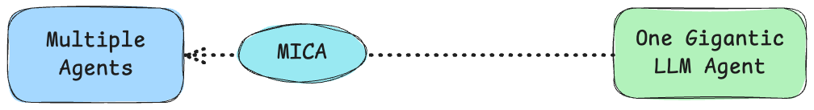

As the capabilities of large language models (LLMs) continue to grow, it is anticipated that natural language will increasingly dominate the design of agents. In this new paradigm, designers only need to provide high-level instructions and domain specific service knowledge, leaving the language model to handle the intricacies of user interaction.  We have the following observations: 

<center>

<br>
<div>Python Programming vs Natural Language Programming</div>
</center>

By their nature, agents are more intuitively formulated through natural language, while Python code better serves as a bridge between agents and the computer world.  Whenever there is an inclination to use Python, there is a possibility of implementing the same logic using natural language.  Here is an example of a natural language command line using LLM(MICA) vs. [Python+LLM](https://github.com/aaalgo/middleman).  MICA aims to move away from Python programming as much as possible. 

example here


<center>

<br>
<div>Control Flow vs Full Flexibility</div>
</center>

Service bots are traditionally developed with rigid flow control.  As long as you would like to give more freedom to users, they will fall apart as it is hard to predict user input.   Achieving true flexibility requires leveraging LLMs.  MICA shifts away from traditional flow control, embracing the power of LLMs to handle complex, open-ended interactions.  While rigid flow control may provide short-term benefits, such as reducing hallucinations and offering a sense of controllability, it will be challenging in the long term if the goal is to provide users with greater freedom to interact with the system.

For example, when we want to implement a transfer chatbot, since traditional flow control tool (Rasa) requires explicitly defining all slots, bot responses, and decision logic, it takes at least 180 lines of YAML (exclude some function code) to complete this task. In contrast, with MICA, you can design the chatbot in under 40 lines.

Below is a partial implementation in [Rasa](https://github.com/RasaHQ/rasa-calm-demo?tab=readme-ov-file#demo-bot):


<details>
  <summary>Show the code</summary>
  <pre><code>flows:
  transfer_money:
    description: send money to friends and family
    name: transfer money
    always_include_in_prompt: True
    steps:
      - collect: transfer_money_recipient
        description: the name of a person
      - id: ask_amount # we keep this id, because we use it for a jump
        collect: transfer_money_amount_of_money
        description: the amount of money without any currency designation
      - action: check_transfer_funds
        next:
          - if: not slots.transfer_money_has_sufficient_funds
            then:
              - action: utter_transfer_money_insufficient_funds
              - set_slots:
                  - transfer_money_amount_of_money: null
                  - transfer_money_has_sufficient_funds: null
                next: ask_amount
          - else: transfer_money_final_confirmation
      - id: transfer_money_final_confirmation
        collect: transfer_money_final_confirmation
        description: accepts True or False
        ask_before_filling: true
        next:
          - if: not slots.transfer_money_final_confirmation
            then:
              - action: utter_transfer_cancelled
                next: END
          - else: execute_transfer
      - id: execute_transfer
        action: execute_transfer
        next:
          - if: slots.transfer_money_transfer_successful
            then:
              - action: utter_transfer_complete
                next: END
          - else:
              - action: utter_transfer_failed
                next: END

actions:
  - check_transfer_funds
  - execute_transfer

slots:
  transfer_money_transfer_successful:
    type: bool
    mappings:
      - type: custom
        action: execute_transfer
  transfer_money_has_sufficient_funds:
    type: bool
    mappings:
      - type: custom
        action: check_transfer_funds
  transfer_money_recipient:
    type: text
    mappings:
      - type: from_llm
  transfer_money_amount_of_money:
    type: text
    mappings:
      - type: from_llm
  transfer_money_final_confirmation:
    type: text
    mappings:
      - type: from_llm

responses:
  utter_transfer_money_insufficient_funds:
    - text: You don't have so much money on your account!
  utter_transfer_failed:
    - text: something went wrong transferring the money.
  utter_out_of_scope:
    - text: Sorry, I'm not sure how to respond to that. Type "help" for assistance.
  utter_ask_transfer_money_amount_of_money:
    - text: How much money do you want to transfer?
  utter_ask_transfer_money_recipient:
    - text: Who do you want to transfer money to?
  utter_transfer_complete:
    - text: Successfully transferred {transfer_money_amount_of_money} to {transfer_money_recipient}.
  utter_transfer_cancelled:
    - text: Transfer cancelled.
  utter_ask_transfer_money_final_confirmation:
    - buttons:
        - payload: yes
          title: "Yes"
        - payload: no
          title: "No, cancel the transaction"
      text: Would you like to transfer {transfer_money_amount_of_money} to {transfer_money_recipient}?
  </code></pre>
</details>

If you use MICA, it will be:
```yaml
transfer_money:
  type: llm_agent
  description: This agent let's users send money to friends and family.
  prompt: |
    You are a smart agent for handling transferring money request. When user ask for transferring money, 
    it is necessary to sequentially collect the recipient's information and the transfer amount. 
    Then, the function "check_transfer_funds" should be called to check whether the account balance is sufficient to cover the transfer. If the balance is insufficient, it should return to the step of requesting the transfer amount. 
    Finally, before proceeding with the transfer, confirm with the user whether the transfer should be made.
  args:
    - recipient
    - amount_of_money
  uses:
    - check_transfer_funds
```

<center>

<br>
<div>Multiple Agents vs One Gigantic LLM Agent</div>
</center>

While it is possible to put all the constraints, all the business logics and knowledge in one gigantic LLM agent, practically it will cause a lot of issues with testing, debugging, reusability, etc.  Modern engineering principles emphasize the importance of designing and testing individual components before integrating them. The same principle applies to agent development.  
MICA considers these observations and advocates for a declarative agent framework as the future of agent design. While it retains flow control and tool calls to facilitate interaction with traditional programming interfaces, MICA prioritizes natural language-based agents as its core element. This agent-centric approach also paves the way for significant advancements in automated testing and evaluation. We will explore these benefits further once MICA’s testing capabilities are put online. 


[Try and Explore MICA Today!](../start/) 

