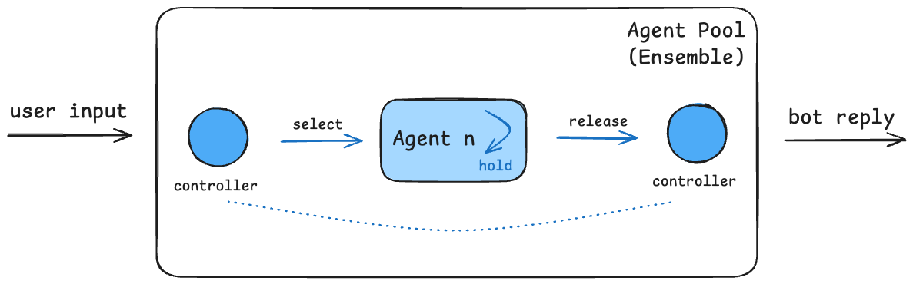

In real-world conversations, users may express their needs in any order.  MICA is designed to MICA is designed to effectively manage this complexity.  We conceptualize a chatbot as a collection of autonomous agents, each capable of independently determining the next course of action—whether to switch agents, wait for user input, conclude the conversation, or take other necessary steps. Ultimately, our goal is to delegate as much conversational control as possible to the LLM, ensuring a more flexible and natural user experience. On the other hand, control can be regained by Flow Agents whenever necessary. 

 

MICA Dynamics

The diagram of a single-turn conversation. Our chatbot is essentially a pool containing multiple agents, with the state of this pool managed by the ensemble agent. When there is user input, the ensemble agent, through the controller, analyzes and selects the most relevant agent from the pool to respond. This agent then takes over the conversation, meaning that as long as the agent believes it can handle the user’s response, it will continue to reply to the user. This assumption is based on the idea that users, in general, do not frequently switch topics, but rather continue within the current context, so there is no need for frequent reassessment of whether a new agent should be selected.

However, when the agent clearly determines that the user’s intention is no longer related to its task, it will automatically release control, handing it back to the ensemble agent, which will then use the controller to choose the next agent to respond. This process continues until the agent determines that it is time for the user to speak again.

Through this mechanism, MICA ensures the independence and modularity of each agent in the chatbot while minimizing the need to call the LLM. This reduces the invocation costs and achieves a good conversational performance.
