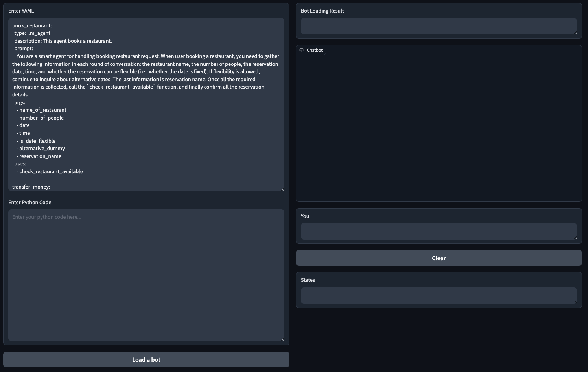

# Quick Start
{: .no_toc .header }

----
Getting started with Mica is simple. We provide two different options: one is local GUI testing, and the other is deploying the service.

## Local GUI Testing

You can design and test the bot through the GUI. You will need Python 3.8 or higher. Then, execute the following command to install the required dependencies:
```bash
pip install -r requirement.txt
```
Set the OPENAI KEY in the local variables.
```bash
export OPENAI_API_KEY=<your key>
```
Finally, execute the following command to start the service:
```bash
python demo.py
```
You can visit `http://localhost:8760` and start to design.


## Local Deployment

To deploy locally, ensure your environment has Docker 20+ installed. For stable performance, it's recommended to allocate 2 CPU cores and 8GB of free memory. Then, start with the following command:

```bash
docker run --hostname Mica -d -v /root/data:/data -p 8080:80 --name Mica Mica/pack:latest
```
- `--hostname Mica`: Avoid the hostname of the container changed each time it restarts.
- `-v /root/data:/data`: Specifies the persistent data storage directory. You can modify it as needed. Failure to configure this will result in data loss after container restart.
- `-p 8080:80`: Sets the external port. Default external port is 80, if you want to set the port to other like 8080, you can add this param.
- `--name Mica`: Sets the container name for easy use in docker command.
- Two image options are available: `Mica/pack:latest` and `Mica/aio:latest`. The former uses collectors directly from GitHub, while the latter integrates the latest collectors into the image, albeit with a larger size.

After the container is started, you can check the logs to see if the system is running:
```bash
docker logs Mica
```

When you see the following log, it means the system is running:
```bash
@@@@@@@@@@@@@@@@@@@@@@@@@@@@@@@@@@@@@@@@@@@@@@@@@@@@@@@@@@@@@@@@@@@@@@@@@@@@
 System is ready! You can access the service as follows:
     URL: http://172.17.0.36
     User: xxx@xxxx
     Password: xxx

 Any question or suggestion, please reach out to xxx@xxx.us! Enjoy!!!
@@@@@@@@@@@@@@@@@@@@@@@@@@@@@@@@@@@@@@@@@@@@@@@@@@@@@@@@@@@@@@@@@@@@@@@@@@@@
```

If you want to upgrade the system, you can use the following command:
```
#!/bin/bash

echo "Upgrade ..."
docker pull Mica/pack:latest
docker stop Mica
docker rm Mica
docker run --hostname Mica -d -v /root/data:/data -p 8080:80 --name Mica Mica/pack:latest
echo "Upgrade Done!"
exit
```

## First Practice
TODO: Add scenario, comments and explanation
### LLM Agent
```yaml
transfer_money:
  type: llm agent
  description: This is an agent for a money transfer request.
  prompt: "You are a smart agent for handling transferring money request. When user ask for transferring money, it is necessary to sequentially collect the recipient's information and the transfer amount. Then, the function \"validate_account_funds\" should be called to check whether the account balance is sufficient to cover the transfer. If the balance is insufficient, it should return to the step of requesting the transfer amount. Finally, before proceeding with the transfer, confirm with the user whether the transfer should be made and then call \"submit_transaction\"."
  args:
    - recipient
    - amount_of_money
  uses:
    - validate_account_funds
    - submit_transaction
```
### Tool usage
```python
import sqlite3

def connect_db():
    return sqlite3.connect('user_info.db')


def validate_account_funds(amount_of_money):
    conn = connect_db()
    cursor = conn.cursor()

    cursor.execute("SELECT account_balance FROM user_info WHERE user_name = ?", ('user',)) 
    account_balance = cursor.fetchone()

    if account_balance is None:
        print("doesn't exist!")
        conn.close()
        return False

    if account_balance[0] >= amount_of_money:
        print("suffient")
        conn.close()
        return True
    else:
        print("insuffient")
        conn.close()
        return False

def submit_transaction(amount_of_money, recipient):
    conn = connect_db()
    cursor = conn.cursor()

    cursor.execute('''
    CREATE TABLE IF NOT EXISTS transactions (
        transaction_id INTEGER PRIMARY KEY AUTOINCREMENT,
        amount_of_money REAL,
        recipient TEXT,
        transaction_time TIMESTAMP DEFAULT CURRENT_TIMESTAMP
    )
    ''')

    cursor.execute('''
    INSERT INTO transactions (amount_of_money, recipient)
    VALUES (?, ?)
    ''', (amount_of_money, recipient))

    conn.commit()
    conn.close()

    print(f"Success. Money: {amount_of_money}, recipient: {recipient}")
```
### Ensemble Agent
```yaml
meta:
  type: ensemble agent
  description: You can select an agent to respond to the user’s question.
  contain:
    - transfer_money
  fallback: default_agent
  steps:
    - call: transfer_money
  exit:
    - policy: "After 5 seconds, give a closure prompt: Is there anything else I can help you with?  After another 30 seconds, then leave."
```
### Add an entrypoint
```yaml
main:
  steps:
    - call: meta
```