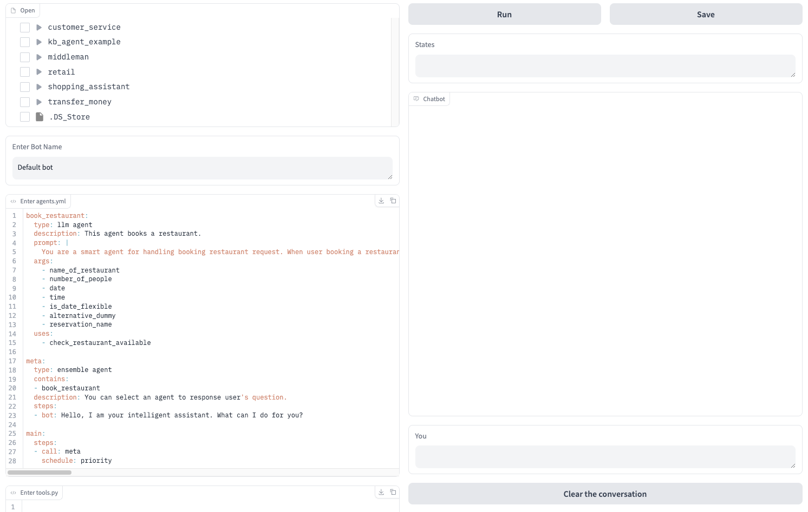
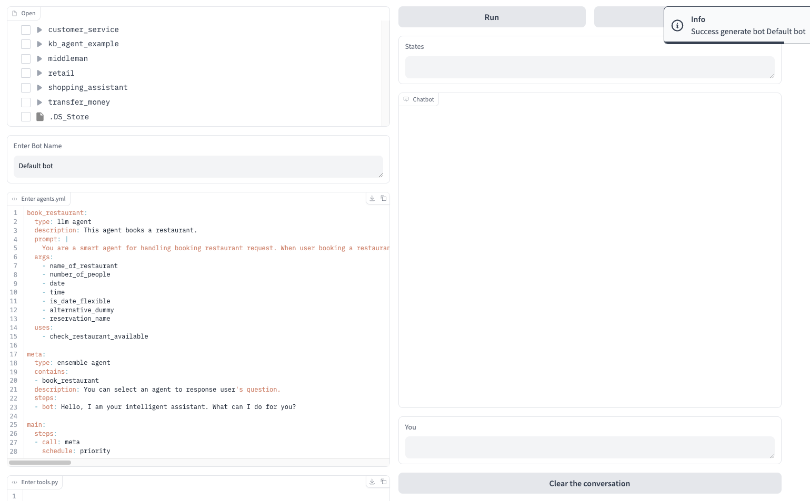
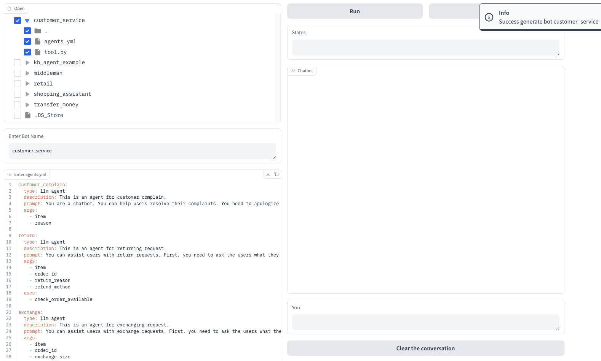
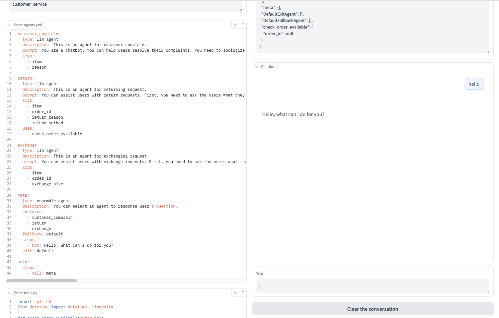

Getting started with MICA is straightforward. There are two options: One is through a local GUI frontend; the other is being deployed with docker image.

## Local GUI Frontend

You can design and test the bot through a local GUI, which requires Python 3.8 or higher.  Please execute the following command to install the required dependencies:
```bash
pip install -r requirement.txt
```
Set the OPENAI KEY.
```bash
export OPENAI_API_KEY=<your key>
```
Then, start the service:
```bash
python demo.py
```
You can visit `http://localhost:7860` and start to design.


## GUI Feature Introduction
The local GUI provides features for online editing, testing, loading bots from local files, and saving bots to local storage.

### Real-time Editing
You can customize your bot on the left side of the page. After editing, click the `Run` button at the top right to generate the bot.  
  
If the generation fails, an alert will be displayed. Please check if your agents' format is correct.  


### Load from Local Examples
You can also load a bot from local examples and modify it as needed. After selecting the bot you want to load, you can start a conversation immediately or modify it further. Please note that if you modify the examples, you need to click the `Run` button before testing the latest bot. 
Additionally, please note that selecting multiple directories at the same time will cause a bot loading error. When deselecting, all unsaved changes will be lost immediately.


### Conversation and State
Once the bot is generated, you can start a conversation with it. Enter your message in the `You` dialog box and press `Enter` to send it. The `Clear the conversation` button clears the conversation history and also resets the `States` panel. The `States` panel displays the current argument values for each agent in the bot.  


### Save to Local
You can save all bots from the left panel to a local file. Clicking the `Save` button will save the current bot information (excluding conversation and state data) to the local folder `../bot-output`. A folder named after the bot will be created, with `agents.yml` storing the agents' information and `tools.py` storing the Python code.

## Locally Deployment
If you need to deploy the bot as a service, you can set up a server using the following steps.  
First, ensure your Python version is 3.8 or higher. The process is similar to the GUI setup:

```bash
pip install -r requirement.txt
```
Set the OpenAI API key:
```bash
export OPENAI_API_KEY=<your key>
```
Finally, start the service:
```bash
python server.py
```
If you want to run the service in the background, you can use the following command. All logs will be stored in server.log in the current directory.
```bash
nohup python -u server.py > server.log 2>&1 &
tail -f server.log
```
## Chat Service
We provide the following APIs for loading bots and handling chat interactions.

### Load Bot
`POST http://localhost:5001/v1/deploy`

This API allows you to load your bot.

**Request Body**
- **file** (file) *Required*: A ZIP file where the filename serves as `bot_name`. The ZIP file must contain `agents.yml` with all agents’ information (Required). It may also include a Python script `tools.py` (Optional).

**Response**
Returns a JSON object:
```json
{
 "status": 200,
 "message": "Already deployed project: {bot_name}"
}
```

### Chat API
`POST http://localhost:5001/v1/chat`

This API allows a user to send a message to a specified bot and receive a response.

**Request Body**
- **sender** (string) *Required*: A unique ID for each user.
- **message** (string) *Required*: The message sent by the user.

**Headers**
- **bot_name** (string) *Required*: The name of the bot to interact with.

**Response**
Returns a JSON array, potentially containing multiple responses:
```json
[{
  "text": "bot response"
}]
```

## First Example
Below is an implementation of a chatbot that can handle the money transfer service. You can copy/paste the following agent code into the same YAML document, e.g., such as `agents.yml`, and the python code into a single python file, e.g., 
 `tool.py`
 
### LLM Agent
The transfer service requires collecting two values: the recipient and the transfer amount. Therefore, you can introduce an LLM agent named “transfer_money” and specify the process in its prompt. Additionally, you can include  two parameters.
```yaml
transfer_money:
  type: llm agent
  description: This is an agent for a money transfer request.
  prompt: "You are a smart agent for handling transferring money request. When user ask for transferring money, it is necessary to sequentially collect the recipient's information and the transfer amount. Then, the function \"validate_account_funds\" should be called to check whether the account balance is sufficient to cover the transfer. If the balance is insufficient, it should return to the step of requesting the transfer amount. Finally, before proceeding with the transfer, confirm with the user whether the transfer should be made and then call \"submit_transaction\"."
  args:
    - recipient
    - amount_of_money
  uses:
    - validate_account_funds
    - submit_transaction
```
### Tool Use
To ensure that the transfer amount is less than the actual account balance, we need to use a function tool to perform argument validation. Below is a custom function that retrieves the balance from a database and then checks the transfer amount.
```python
import sqlite3

def connect_db():
    return sqlite3.connect('user_info.db')


def validate_account_funds(amount_of_money):
    conn = connect_db()
    cursor = conn.cursor()

    cursor.execute("SELECT account_balance FROM user_info WHERE user_name = ?", ('user',)) 
    account_balance = cursor.fetchone()

    if account_balance is None:
        print("doesn't exist!")
        conn.close()
        return False

    if account_balance[0] >= amount_of_money:
        print("suffient")
        conn.close()
        return True
    else:
        print("insuffient")
        conn.close()
        return False
```
Once the transfer request is confirmed, we usually connect to a database to perform the actual transfer operation. Here, we implement a Python function to accomplish this task. The LLM agent will automatically call this function to submit the transaction information.
```python
def submit_transaction(amount_of_money, recipient):
    conn = connect_db()
    cursor = conn.cursor()

    cursor.execute('''
    CREATE TABLE IF NOT EXISTS transactions (
        transaction_id INTEGER PRIMARY KEY AUTOINCREMENT,
        amount_of_money REAL,
        recipient TEXT,
        transaction_time TIMESTAMP DEFAULT CURRENT_TIMESTAMP
    )
    ''')

    cursor.execute('''
    INSERT INTO transactions (amount_of_money, recipient)
    VALUES (?, ?)
    ''', (amount_of_money, recipient))

    conn.commit()
    conn.close()

    print(f"Success. Money: {amount_of_money}, recipient: {recipient}")
```
### Ensemble Agent
You can define an Ensemble Agent to manage and coordinate the activation of multiple agents. In a simple scenario, such as a money transfer example with only one agent, an Ensemble Agent is not required. However, if your chatbot includes multiple agents that must handle various user intents, an Ensemble Agent becomes essential. It serves as a central entity that organizes and directs the interactions between agents. For instance, if there is a Knowledge Base (KB) agent responsible for answering user queries, the Ensemble Agent would ensure seamless coordination between it and other agents.
```yaml
meta:
  type: ensemble agent
  description: You can select an agent to respond to the user’s question.
  contains:
    - transfer_money
    - kb
  fallback: default_agent
  exit: "After 5 seconds, give a closure prompt: Is there anything else I can help you with?  After another 30 seconds, then leave."
```
### Which Agent to Start
As the `agent.yml` file contains multiple agents, it is necessary to designate an initial agent to start the process. The main agent serves this purpose, acting as the entry point for the chatbot. Its steps can invoke any agent; however, in most cases, it calls an Ensemble agent to coordinate interactions among different agents.
```yaml
main:
  type: flow agent
  steps:
    - call: meta
```
