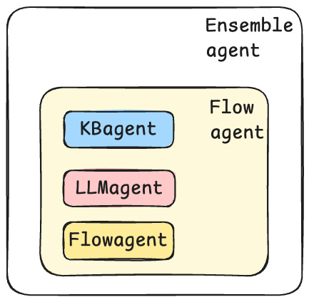

# What is MICA

{: .header}

---

MICA is a new multi-agent editing specification that allows the implementation of complex dialogue systems and the handling of various real-world problems without the need to write code, by defining specific types of agents. The system architecture of MICA consists of four different agents: LLM Agent, Flow Agent, KB Agent, and Ensemble Agent.


Current conversational AI design frameworks include Swarm, Rasa Pro, LangGraph, etc. Some of these rely on OpenAI’s framework but do not provide effective logical control (Swarm), while others are limited by the traditional pipeline model in QA systems, failing to leverage the powerful language understanding and processing capabilities of LLMs (Rasa Pro). There are also frameworks that rely on coding skills, making it difficult to design chatbots intuitively and conveniently (LangGraph). In comparison, MICA offers a complete definition, a self-consistent system, and, most importantly, MICA’s unique design specification allows it to evaluate the performance of chatbots designed using LLMs. Next, we will demonstrate this through a comparison of the performance of different frameworks.

Take a chatbot that handles flight modifications, cancellations, and lost luggage as an example. Using Swarm, we need to define each agent and all possible transitions between the agents. Below is the implementation provided by Swarm, and you can find the complete information in their [code repository](https://github.com/openai/swarm/tree/main/examples/airline).
```python
def transfer_to_flight_modification():
    return flight_modification


def transfer_to_flight_cancel():
    return flight_cancel


def transfer_to_flight_change():
    return flight_change


def transfer_to_lost_baggage():
    return lost_baggage


def transfer_to_triage():
    """Call this function when a user needs to be transferred to a different agent and a different policy.
    For instance, if a user is asking about a topic that is not handled by the current agent, call this function.
    """
    return triage_agent
```
```python
def triage_instructions(context_variables):
    customer_context = context_variables.get("customer_context", None)
    flight_context = context_variables.get("flight_context", None)
    return f"""You are to triage a users request, and call a tool to transfer to the right intent.
    Once you are ready to transfer to the right intent, call the tool to transfer to the right intent.
    You dont need to know specifics, just the topic of the request.
    When you need more information to triage the request to an agent, ask a direct question without explaining why you're asking it.
    Do not share your thought process with the user! Do not make unreasonable assumptions on behalf of user.
    The customer context is here: {customer_context}, and flight context is here: {flight_context}"""


triage_agent = Agent(
    name="Triage Agent",
    instructions=triage_instructions,
    functions=[transfer_to_flight_modification, transfer_to_lost_baggage],
)

flight_modification = Agent(
    name="Flight Modification Agent",
    instructions="""You are a Flight Modification Agent for a customer service airlines company.
      You are an expert customer service agent deciding which sub intent the user should be referred to.
You already know the intent is for flight modification related question. First, look at message history and see if you can determine if the user wants to cancel or change their flight.
Ask user clarifying questions until you know whether or not it is a cancel request or change flight request. Once you know, call the appropriate transfer function. Either ask clarifying questions, or call one of your functions, every time.""",
    functions=[transfer_to_flight_cancel, transfer_to_flight_change],
    parallel_tool_calls=False,
)

flight_cancel = Agent(
    name="Flight cancel traversal",
    instructions=STARTER_PROMPT + FLIGHT_CANCELLATION_POLICY,
    functions=[
        escalate_to_agent,
        initiate_refund,
        initiate_flight_credits,
        transfer_to_triage,
        case_resolved,
    ],
)

flight_change = Agent(
    name="Flight change traversal",
    instructions=STARTER_PROMPT + FLIGHT_CHANGE_POLICY,
    functions=[
        escalate_to_agent,
        change_flight,
        valid_to_change_flight,
        transfer_to_triage,
        case_resolved,
    ],
)

lost_baggage = Agent(
    name="Lost baggage traversal",
    instructions=STARTER_PROMPT + LOST_BAGGAGE_POLICY,
    functions=[
        escalate_to_agent,
        initiate_baggage_search,
        transfer_to_triage,
        case_resolved,
    ],
)
```
With MICA, you only need to define a few LLM Agents to enable seamless switching between different scenario. Below is the equivalent implementation in MICA.
```yaml
Flight Cancel:
  type: llm agent
  args:
   - flight_number
  description: It can handle flight cancel request.
  prompt: <Flight Cancel Policy>
  
Flight Change:
  type: llm agent
  args:
    - flight_number
  description: It can handle flight change request.
  prompt: <Flight Change Policy>
  uses:
    - change_flight

Lost Baggage:
  type: llm agent
  args:
    - flight_number
    - address
  description: It can handle baggage lost request.
  prompt: <Lost Baggage Policy>

Meta:
  type: ensemble agent
  contain:
    - Flight Cancel
    - Flight Change
    - Lost Baggage

main:
  steps:
    - call: Meta
```

Another example is a chatbot that includes restaurant booking and money transfer. Rasa Pro provides an implementation for this part.

When booking a restaurant, the chatbot needs to sequentially collect the restaurant name, number of people, reservation date, and time. Then, it checks whether the reservation time is available. Finally, it confirms all the reservation details.

When transferring money, the chatbot needs to sequentially collect the recipient’s name and the transfer amount. Afterward, it checks whether the account balance is sufficient to cover the payment. If the balance is insufficient, it prompts the user to adjust the amount. Lastly, it confirms all the information with the user before completing the transfer.

Since Rasa Pro requires explicitly defining all slots, bot responses, and decision logic, it takes at least 180 lines of YAML (in addition to some function code) to complete this task. In contrast, with MICA, you can design the chatbot in under 40 lines.

Below is a partial implementation in [Rasa](https://github.com/RasaHQ/rasa-calm-demo?tab=readme-ov-file#demo-bot):
```yaml
flows:
  transfer_money:
    description: send money to friends and family
    name: transfer money
    always_include_in_prompt: True
    steps:
      - collect: transfer_money_recipient
        description: the name of a person
      - id: ask_amount # we keep this id, because we use it for a jump
        collect: transfer_money_amount_of_money
        description: the amount of money without any currency designation
      - action: check_transfer_funds
        next:
          - if: not slots.transfer_money_has_sufficient_funds
            then:
              - action: utter_transfer_money_insufficient_funds
              - set_slots:
                  - transfer_money_amount_of_money: null
                  - transfer_money_has_sufficient_funds: null
                next: ask_amount
          - else: transfer_money_final_confirmation
      - id: transfer_money_final_confirmation
        collect: transfer_money_final_confirmation
        description: accepts True or False
        ask_before_filling: true
        next:
          - if: not slots.transfer_money_final_confirmation
            then:
              - action: utter_transfer_cancelled
                next: END
          - else: execute_transfer
      - id: execute_transfer
        action: execute_transfer
        next:
          - if: slots.transfer_money_transfer_successful
            then:
              - action: utter_transfer_complete
                next: END
          - else:
              - action: utter_transfer_failed
                next: END

actions:
  - check_transfer_funds
  - execute_transfer

slots:
  transfer_money_transfer_successful:
    type: bool
    mappings:
      - type: custom
        action: execute_transfer
  transfer_money_has_sufficient_funds:
    type: bool
    mappings:
      - type: custom
        action: check_transfer_funds
  transfer_money_recipient:
    type: text
    mappings:
      - type: from_llm
  transfer_money_amount_of_money:
    type: text
    mappings:
      - type: from_llm
  transfer_money_final_confirmation:
    type: text
    mappings:
      - type: from_llm

responses:
  utter_transfer_money_insufficient_funds:
    - text: You don't have so much money on your account!
  utter_transfer_failed:
    - text: something went wrong transferring the money.
  utter_out_of_scope:
    - text: Sorry, I'm not sure how to respond to that. Type "help" for assistance.
  utter_ask_transfer_money_amount_of_money:
    - text: How much money do you want to transfer?
  utter_ask_transfer_money_recipient:
    - text: Who do you want to transfer money to?
  utter_transfer_complete:
    - text: Successfully transferred {transfer_money_amount_of_money} to {transfer_money_recipient}.
  utter_transfer_cancelled:
    - text: Transfer cancelled.
  utter_ask_transfer_money_final_confirmation:
    - buttons:
        - payload: yes
          title: "Yes"
        - payload: no
          title: "No, cancel the transaction"
      text: Would you like to transfer {transfer_money_amount_of_money} to {transfer_money_recipient}?
```
If you use MICA, it will be:
```yaml
transfer_money:
  type: llm_agent
  description: This agent let's users send money to friends and family.
  prompt: |
    You are a smart agent for handling transferring money request. When user ask for transferring money, it is necessary to sequentially collect the recipient's information and the transfer amount. Then, the function "check_transfer_funds" should be called to check whether the account balance is sufficient to cover the transfer. If the balance is insufficient, it should return to the step of requesting the transfer amount. Finally, before proceeding with the transfer, confirm with the user whether the transfer should be made.
  args:
    - recipient
    - amount_of_money
  uses:
    - check_transfer_funds
```
MICA makes chatbot design simpler and more convenient. No programming skills are required, and there is no steep learning curve. We strive to make the design of all chatbots based on natural language, rather than programming.
